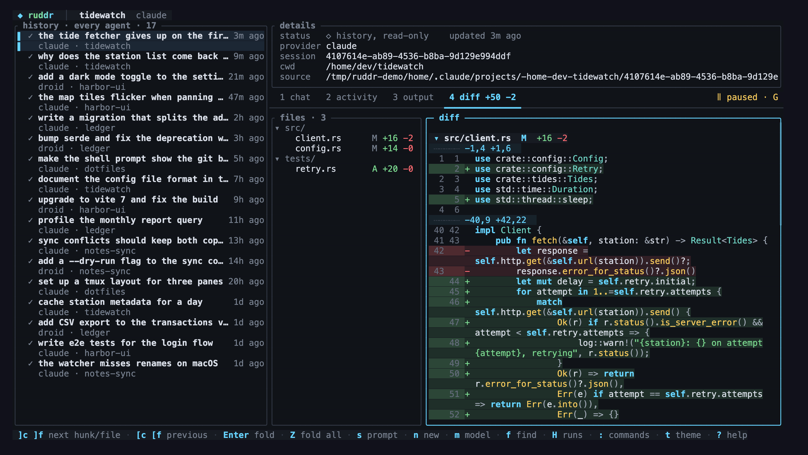

# Ruddr

**A control plane for agents that run other agents.**

Ruddr is a single native binary that keeps a live handle on long-running Codex,
Claude Code, OpenCode 2, Pi, and Factory Droid sessions. An orchestrating agent
launches a turn in the background, reads its progress from plain files, and
redirects it over a local socket while it runs, without waiting for it to
finish or restarting it. Every command works the same from a human shell, so a
person can watch or steer too, but the primary operator is another agent.



```bash
ruddr run --prompt-file task.md --state-dir run &   # start a turn
ruddr peek --state-dir run                          # watch it think
ruddr steer --state-dir run "tests first, skip the benchmark"
ruddr tui                                           # every session, live
ruddr web                                           # the same, in a browser
```

## Why it exists

Agent harnesses increasingly delegate: one agent plans, spawns a coding agent
for the long turn, and keeps working while it runs. `codex exec --json` cannot
support that loop. Its output is observable, but its stdin closes after the
initial prompt, so the orchestrator can only wait for the turn or kill it. Both waste the work
already done, and mid-flight discoveries (a wrong assumption, new user input, a
better plan) cannot reach the running turn.

Ruddr owns the provider connection and exposes a small local control socket.
A later command from the orchestrating agent, a cron job, or a human can steer
the turn that is already running.

Ruddr is built for agents first:

- **State is plain files.** An orchestrator polls or tails `state.json`,
  `events.jsonl`, and `output.md` without a TTY.
- **Commands print JSON where metadata matters.** Skills and scripts read
  `ruddr thread ...` results without scraping text.
- **Steering is a CLI call.** It talks to the socket, is safe to issue from a
  background task, and fails loudly when the turn is gone instead of starting a
  replacement.
- The TUI, the web dashboard, and human steering use the same files and
  socket. They are optional.

Providers:

- **Codex.** Ruddr owns a `codex app-server` connection and calls `turn/steer`
  on the running turn.
- **Claude Code.** Ruddr drives the `claude` CLI directly over its
  stream-json protocol. A persistent streaming-input queue makes steering
  part of the same live session, and the structured events expose summarized
  reasoning, assistant updates, and tool lifecycle to the same TUI used for
  Codex.
- **OpenCode 2.** Ruddr runs a private v2 server and uses its durable session
  inbox. Steering uses `delivery: "steer"` on the active session.
- **Pi.** Ruddr runs Pi in JSONL RPC mode. Pi exposes native steering,
  interruption, session persistence, streamed tool events, and usage totals.
- **Factory Droid.** Ruddr runs `droid exec` in stream JSON-RPC mode. A steer
  is a user message that Droid queues and reads at its next step.

All providers use the same state directory, commands, and TUI. Codex speaks
the app-server protocol itself. For the other four, Ruddr starts its own
binary as a hidden adapter, `ruddr app-server --provider NAME`, which
translates the provider's protocol into the Codex app-server protocol on
stdio.

```text
task launcher ──stdio JSON-RPC──> provider app-server or adapter
      │
      ├── state.json / events.jsonl / trace.log / output.md
      │
      └── local control socket <── ruddr steer "focus on the failing test first"
```

Ruddr does not replace the engine, model, or auth provider. Like a ship's
rudder, it changes the heading of a turn that is already running.

## Status

Ruddr is an early working prototype. Provider protocols change quickly, so
reverify Ruddr after provider upgrades. OpenCode support targets the 2.0 preview CLI
through `opencode2` or `opencode-next`. Ruddr does not support OpenCode 1 yet.

Ruddr 0.6.0 is a Rust rewrite. One binary holds the CLI, the run controller,
the provider adapters, the TUI, and the web dashboard, and nothing needs Bun
or Go at runtime. [Changes in 0.6.0](#changes-in-060) lists the behavior that
differs from 0.5.

Native Windows runs work as of 0.4.3 without access control of their own; see the
[Windows access note](#windows-access). Use WSL, Linux, or macOS
when other accounts share the machine. As of 0.4.5, detached runs and
TUI-started sessions survive the end of an SSH connection to a Windows host,
and `--remote` drives hosts whose SSH shell is PowerShell.

Adding a provider means implementing one adapter behind the existing
`--provider` flag. The state directory, control socket, steering commands, and
TUI are provider-agnostic already.

### Changes in 0.6.0

The commands, flags, exit codes, run directory files, registry, config files,
and environment variables of 0.5 still work. These behaviors changed:

- Flags are GNU style only: `--flag value` or `--flag=value`. The Go
  single-dash form (`-state-dir DIR`) is rejected as bad usage. Flags may
  follow positional arguments, as in `ruddr steer "text" --state-dir DIR`.
- `steer`, `prompt`, `interrupt`, and single-run `stop` exit 4 when the run's
  controller is gone, like `wait`.
- An unknown command exits 2, and so does `run` with an invalid `--provider`.
- `steer` without `--expected-turn-id` pins the turn it observed in
  `state.json`, so a steer never lands on a later turn.
- `ruddr thread --provider NAME` sends the request to another provider's
  adapter instead of `codex app-server`.
- `ruddr stop` sends the same control request as 0.5, so a 0.6 binary can stop
  an idle session that a 0.5 controller runs.
- `ruddr run --help` prints to stdout.
- Ctrl-C during the `run --detach` startup wait stops the launcher. The
  detached controller keeps running.
- During shutdown, Ruddr waits at most 5 seconds for the provider to exit after
  SIGKILL, then records a warning in `trace.log` and moves on.
- Runs that the TUI and web dashboard start use directory names of the form
  `YYYYMMDD-HHMMSS-<hex>` (UTC), like `ruddr run`.
- The web dashboard answers a stale prompt route with HTTP 409 instead of 500.
- The dashboards no longer scan `ps` for running runs that predate the
  global registry. Point `--root` or `--state-dir` at such a run to see it.
- On Windows the control channel is a named pipe instead of a Unix socket.
- The Claude adapter drives the `claude` CLI directly instead of the Claude
  Agent SDK, so it needs no Node or Bun dependency.
- `RUDDR_TUI_ENTRY`, `RUDDR_WEB_ENTRY`, and the `RUDDR_*_ADAPTER_ENTRY`
  variables are gone, along with the `tui --rs` flag.

> Ruddr was previously published as Rudder and, before that, Codex Rudder.
> Settings, registries, and install locations from both earlier names keep
> working: `RUDDER_*` and `CODEX_RUDDER_*` environment variables are read as
> fallbacks, earlier `~/.config` and `~/.local/state` directories are searched
> after the new ones, and the `rudder` command stays as an alias.

## Install

The quickest route is the npm package. It contains a small Node launcher that
downloads the prebuilt `ruddr` binary for your platform from the matching
GitHub release, verifies it, and runs it. The binary holds all of Ruddr,
including the TUI, the web dashboard, and the provider adapters:

```bash
npm install -g ruddr
# or
bun add -g ruddr
ruddr --help
```

Prebuilt binaries cover macOS (Apple Silicon and Intel), Linux (x64 and
arm64, statically linked against musl), and Windows x64. Every download is
verified against the SHA-256 checksums pinned inside the published package.
The package contains no sources and never builds anything. On any other
platform, or when the download fails, the launcher exits with an error that
says how to build Ruddr yourself (see [Build](#build)). Set `RUDDR_BINARY` to
the path of a binary you built, and the launcher runs it instead of
downloading one. `RUDDR_SKIP_DOWNLOAD=1` skips the download; without
`RUDDR_BINARY` the launcher then fails with the same error.

The install-time fetch only saves time on the first run. The launcher checks
for the binary on every invocation and downloads it when it is missing. An npm
policy that blocks install scripts therefore delays the first `ruddr` call and
changes nothing else. That policy also skips the bundled delegate skill. Run
`ruddr skill install` once after an install that reported blocked scripts.

`npm install -g` needs write access to the global prefix. Install into a user
prefix when it does not have that access:

```bash
npm install -g --prefix "$HOME/.local" ruddr
```

The npm launcher needs Node 18 or newer. The binary itself needs nothing else
at runtime: no Bun, Go, or Node. Each provider needs its own CLI on `PATH`
(see [Build](#build) for the versions Ruddr is verified against).

### Updating

```bash
ruddr update --check   # report whether a newer release exists
ruddr update           # install it
```

Ruddr looks up the latest GitHub release at most once a day, on `ruddr version`
and in the background of `ruddr tui` and `ruddr web`, and caches the answer
under `~/.local/state/ruddr/update-check.json`. When a newer release exists,
`ruddr version` prints a notice, and the TUI shows a status toast, shows an
`↑ VERSION` badge in its header, and offers **Update Ruddr** in the command
palette.
Set `RUDDR_NO_UPDATE_CHECK=1` to disable the check.
Failed automatic checks also wait a day before retrying and retain the last
known release. `ruddr update --check` always performs a fresh lookup.

`ruddr update` picks the install channel from where the binary lives:

- A binary inside a global npm or bun package is reinstalled at the new
  version through that tool (`npm install -g ruddr@X.Y.Z` or
  `bun add -g ruddr@X.Y.Z`).
- A standalone binary is replaced in place after the download is verified
  against the release's `checksums.txt`. A binary that
  `scripts/install-local.sh` copied into `~/.local/bin` is a standalone
  binary, so `ruddr update` replaces it with the release build.
- A binary at the root of a source checkout is left alone. Ruddr tells you to
  run `git pull` there and rerun `scripts/install-local.sh`.

Every `ruddr update` also reinstalls the `ruddr-delegate` skill into the default
skill directories, including when Ruddr is already up to date. After an upgrade
the new binary writes its own copy, so the skill always matches the installed
release even when a package manager skipped its postinstall hook.

Releases are cut by pushing a `vX.Y.Z` tag that matches the `version` under
`[workspace.package]` in `Cargo.toml` and the `version` in `package.json`.
The workflow builds every platform, attaches the binaries and checksums to a
GitHub release, and publishes the npm package.

### Companion: dejavu

[dejavu](https://github.com/safzanpirani/dejavu) searches past Codex, Claude
Code, Pi, OpenCode, and Factory Droid transcripts on the same machine. Ruddr
uses it in two places: the TUI's and the web dashboard's `f` key runs `deja
find` to look up an earlier session, open it read-only, or continue it under
Ruddr, and agents driving Ruddr use
`dejavu` to recall what earlier runs decided or changed before they delegate
new work. The `H` history browser in the TUI and the web dashboard reads the same stores with parsers
that follow dejavu's. dejavu is a separate single binary; install it from its
latest release and keep it current with `dejavu self-update`:

```bash
curl -fsSL -o ~/.local/bin/dejavu https://github.com/safzanpirani/dejavu/releases/latest/download/dejavu-darwin-arm64
chmod +x ~/.local/bin/dejavu && ln -sf dejavu ~/.local/bin/deja
```

Pick the asset for your platform: `dejavu-darwin-arm64`, `dejavu-darwin-x64`,
`dejavu-linux-x64`, `dejavu-linux-arm64`, or `dejavu-windows-x64.exe`. Ruddr
works without it; `f` then says that `deja` is not on `PATH`.

## Build

Ruddr builds with Rust stable, 1.88 or newer:

```bash
cargo build --release -p ruddr-cli   # target/release/ruddr
```

`scripts/install-local.sh` runs the workspace tests, builds the release
binary, copies it to `~/.local/bin/ruddr` (`RUDDR_BIN_DIR` overrides the
directory), adds the `rudder` alias, and installs the delegate skill:

```bash
./scripts/install-local.sh
```

The build needs no Bun. The browser client for `ruddr web` is committed as a
prebuilt bundle in `crates/ruddr-web/assets` and embedded in the binary. Bun
1.4 or newer is needed only to rebuild that bundle after changing
`web/client` (see [Development](#development)).

Codex runs require a CLI with `codex app-server` and `turn/steer` support;
that command surface is verified against `codex-cli 0.145.0`. Claude runs
require the `claude` CLI and use the caller's normal Claude Code
authentication. The Claude adapter speaks the stream-json protocol that Claude
Agent SDK 0.3.245 used; its verification against a current `claude` CLI
release is pending. OpenCode runs require
the `opencode2` or `opencode-next` executable and are verified against
OpenCode 2.0.15. The adapter uses the `/api/experimental/session` wait and
export routes that 2.0.15 introduced, and falls back to the older
`/api/session` routes on a 404.

Pi runs require the `pi` executable with RPC mode. Droid runs require the
`droid` executable and are verified against droid 0.228.0 and 0.230.0, which
speak Factory protocols 1.233.0 and 1.241.0. The adapters inherit each CLI's normal authentication
environment.

## Run a task

Create a self-contained prompt and a run directory:

```bash
mkdir -p .scratch/ruddr-demo
$EDITOR .scratch/ruddr-demo/prompt.md

ruddr run \
  --provider codex \
  --cwd "$PWD" \
  --prompt-file .scratch/ruddr-demo/prompt.md \
  --state-dir .scratch/ruddr-demo/run \
  --model gpt-6-astra \
  --sandbox workspace-write
```

`--provider` defaults to `codex`, so existing commands do not need to change.

Flags are GNU style: `--flag value` or `--flag=value`, before or after
positional arguments. `--` ends the flags; everything after it in `run` is the
app-server command. Every command prints its flags with `--help`.

`--state-dir` is optional. Without it, Ruddr creates
`.scratch/ruddr/<time>-<id>` under `--cwd`, prints the path (`run --detach`
prints it on stdout, a foreground run on stderr), and writes a `.gitignore`
into `.scratch/ruddr` so run files stay out of `git status`. Sessions started
from `ruddr tui` or `ruddr web` live in `.scratch/ruddr-tui`, which ignores
itself the same way. Pass `--state-dir` when you want to choose the location.

`--config KEY=VALUE` (repeatable) overrides a `~/.codex/config.toml` setting
for one Codex run. A run fails at `thread/start` when that file enables a
feature the chosen model rejects:

```bash
ruddr run --prompt-file task.md --model gpt-6-sol \
  --config features.token_budget.use_history_notes_extension=false
```

`--config` works with the default `codex app-server` command. With a custom
command after `--`, add `-c KEY=VALUE` to that command instead.

Commands exit with distinct codes, so scripts can branch without parsing
text:

| Code | Meaning |
|---|---|
| 0 | success |
| 1 | a run failed or was interrupted, or any other error |
| 2 | bad usage: an unknown command or flag, an invalid `run --provider`, or a missing required argument |
| 3 | still running: `wait` timed out, or `result` was asked of an unfinished run |
| 4 | stale: a controller died without persisting a terminal state; `wait`, `steer`, `prompt`, `interrupt`, and single-run `stop` exit 4 for such a run |

Run Claude Code through the same control plane:

```bash
ruddr run \
  --provider claude \
  --cwd "$PWD" \
  --prompt-file .scratch/ruddr-demo/prompt.md \
  --state-dir .scratch/ruddr-demo/claude.run \
  --effort high \
  --sandbox workspace-write
```

Omit `--model` to use Claude Code's configured default. Ruddr finds the
`claude` executable in this order: `--claude-path`, then `RUDDR_CLAUDE_PATH`,
then `claude` on `PATH`. Set `RUDDR_CLAUDE_PATH` to make a choice persistent.
Point either at a wrapper script when your
Claude authentication depends on shell or Keychain setup that a detached
process does not inherit. `read-only` maps to Claude's `plan` mode.
`workspace-write` uses `acceptEdits` and enables Claude's command sandbox. It
automatically allows Bash only when Claude runs the command inside that
sandbox, adds the working directory to the writable paths, and fails if the
sandbox is unavailable. `danger-full-access` maps to `bypassPermissions`.
Ruddr denies any operation that still requires interactive approval.

Run OpenCode 2 or Pi through the same surface:

```bash
ruddr run --provider opencode --cwd "$PWD" \
  --prompt-file .scratch/ruddr-demo/prompt.md \
  --state-dir .scratch/ruddr-demo/opencode.run

ruddr run --provider pi --cwd "$PWD" \
  --prompt-file .scratch/ruddr-demo/prompt.md \
  --state-dir .scratch/ruddr-demo/pi.run
```

The default model for both adapters is
`openrouter/deepseek/deepseek-v4-flash-vision-exp`. Use `--opencode-path` or
`RUDDR_OPENCODE_PATH` to select an OpenCode 2 executable; without either,
Ruddr looks for `opencode2`, then `opencode-next`, on `PATH`. Use `--pi-path`
or `RUDDR_PI_PATH` to select a Pi executable; without either, Ruddr looks for
`pi` on `PATH`. OpenCode installs private
Ruddr-scoped agents with explicit permission rules for each sandbox value. Pi
disables extensions and enables only its read, grep, find, and list tools for
`read-only`. Both adapters use their provider's native permission system. They
do not provide Ruddr-enforced filesystem containment for `workspace-write`.
Run these adapters only in trusted workspaces. OpenCode 2 loads project
configuration and plugins, and Pi loads project-local resources after approval.
Those resources can execute code outside the adapters' tool permission rules.

Run Factory Droid the same way:

```bash
ruddr run --provider droid --cwd "$PWD" \
  --prompt-file .scratch/ruddr-demo/prompt.md \
  --state-dir .scratch/ruddr-demo/droid.run
```

The default Droid model is `glm-5.3-flash`, with efforts `low`, `high`, and
`max`. `droid exec --help` lists every model your Factory account offers. Use
`--droid-path` or `RUDDR_DROID_PATH` to select a Droid executable; without
either, Ruddr looks for `droid` on `PATH`. The sandbox
sets Droid's autonomy level: `read-only` runs at `off`, `workspace-write` at
`medium`, and `danger-full-access` at `high`. Droid enforces these levels
itself. Ruddr adds no filesystem containment. Ruddr rejects every Droid
permission request and question. A tool call above the autonomy level
therefore ends the turn as failed, and the error names the autonomy level.
Droid sessions always persist, so `--ephemeral` is refused. `--fork-thread`
copies the whole Droid session. `--fork-before-turn` and `--fork-through-turn`
are not supported for Droid.

Run it in the background from an agent harness so the harness can continue
reading user messages and issue steering commands. `--detach` does this without
harness support. It starts the controller in its own session, writes the
child's early stderr to `launch.stderr.log`, and returns once the run reports
`active`, `idle`, or `completed`. On Windows it also leaves the OpenSSH
session's job object, which would otherwise kill the run when the SSH
connection closes. A controller that fails during startup makes
`run --detach` exit non-zero with that stderr. The launcher waits up to 15
seconds for the run to start. A controller still starting after that keeps
running, and the launcher returns without retrying. Ctrl-C during the wait
stops only the launcher; the detached controller keeps running. `--prompt-file -` reads the
prompt from stdin and stores it as `prompt.md` (`0600`) inside the state
directory; `steer` and `prompt` accept `--message-file -` the same way.

`--turn-timeout` defaults to one hour and stops a silently hung turn and its
child process group. Set it to `0` only when an unbounded run is intentional.
`SIGINT` and `SIGTERM` mark the run interrupted, terminate the app-server
process group, and remove the control socket before Ruddr exits. Ruddr sends
the provider SIGTERM and closes its stdin, escalates to SIGKILL after 3
seconds, and waits at most 5 more seconds before it records a warning and
exits. On Windows, Ctrl-C, Ctrl-Break, and closing the console do the same.

Resume an existing provider thread or session for another steerable turn:

```bash
ruddr run \
  --resume-thread THREAD_ID \
  --cwd "$PWD" \
  --prompt-file .scratch/ruddr-demo/prompt.md \
  --state-dir .scratch/ruddr-demo/resumed-run
```

Fork first when the new work should preserve the source thread:

```bash
ruddr run \
  --fork-thread THREAD_ID \
  --fork-before-turn TURN_ID \
  --cwd "$PWD" \
  --prompt-file .scratch/ruddr-demo/prompt.md \
  --state-dir .scratch/ruddr-demo/forked-run
```

Use `--fork-through-turn TURN_ID` instead to include the selected turn.

## Discover and manage Codex threads

`ruddr thread` prints the app-server result as JSON so agent skills and shell
scripts can consume pagination cursors and complete metadata without scraping
human-formatted output. It asks `codex app-server` by default:

```bash
ruddr thread list --limit 20 --cwd-filter "$PWD"
ruddr thread search --limit 10 "parser regression"
ruddr thread read --include-turns THREAD_ID
ruddr thread turns --limit 20 THREAD_ID

ruddr thread fork --before-turn TURN_ID THREAD_ID
ruddr thread name THREAD_ID "Parser regression investigation"
ruddr thread archive THREAD_ID
ruddr thread unarchive THREAD_ID
```

Every thread subcommand also accepts a stdio-compatible child command after
`--`, using the same private auth-bridge composition as `ruddr run`.

`--provider NAME` sends the request to another provider's adapter
(`ruddr app-server --provider NAME`) instead. The adapters implement only the
run lifecycle, so they answer most thread actions with a method-not-found
error. A command after `--` works only with Codex.

## Steer the active turn

```bash
ruddr steer \
  --state-dir .scratch/ruddr-demo/run \
  "New information: the regression starts in parser.go. Focus there first."
```

The command fails if the turn is no longer active or the active turn ID does
not match. It never silently starts a replacement turn.

For exact multiline input:

```bash
ruddr steer --state-dir .scratch/ruddr-demo/run \
  --message-file .scratch/ruddr-demo/steer.md
```

Automation can pass `--expected-turn-id ID` to reject a steer when the selected
session advances to another active turn before submission. Without the flag,
`steer` reads the active turn ID from `state.json` and sends that, so the
controller rejects the steer if a later turn has started. `steer`, `prompt`,
and `interrupt` exit 4 when the run's controller is gone.

## Idle sessions: multi-turn without new processes

`ruddr run --idle` keeps the controller and provider alive after a turn
finishes. The run's status becomes `idle` and the control socket accepts new
turns on the same thread:

```bash
ruddr run --idle --prompt-file task.md --state-dir .scratch/demo/run &
ruddr wait  --state-dir .scratch/demo/run   # blocks through idle; Ctrl+C to stop watching
ruddr prompt --state-dir .scratch/demo/run "Now add tests for the fix."
ruddr stop   --state-dir .scratch/demo/run  # graceful shutdown while idle
```

Rules:

- `prompt` works only while the session is idle; `steer` works only while a
  turn is active. Neither command is ever converted into the other.
- `interrupt` during a turn returns an idle session to `idle` instead of
  killing the provider; `stop` ends an idle session gracefully.
- `--idle-timeout` (default 4h) exits the session after that long idle; the
  final persisted status is the last turn's terminal status.
- `--turn-timeout` applies per turn.
- `output.md` separates turns with `---`; each prompt attempt is recorded as a
  synthetic `userMessage` item followed by an append-only decision event in
  `events.jsonl`. The TUI hides rejected attempts.
- state.json gains `idle`, `turns`, `lastTurnStatus`, and `tokenUsage`
  (cumulative counts, context window, and cost when the provider reports one).
  `lastTurnStatus` keeps how the latest turn ended after the session returns
  to `idle`. Prompt text still never reaches state.json.
- `wait --turn` returns when the current turn ends instead of blocking
  through idle, and fails when that turn did not complete.
- The `idle` field records that the run was started with `--idle`. It stays
  `true` while the session is `starting` or `active`. Poll `status == "idle"`
  to know when `prompt` will be accepted.

### Models

`ruddr models [--json]` prints the model catalog: each provider's models and
its default. The TUI's picker uses it, and `ruddr run` without `--model` uses
the default.

The Codex catalog includes `gpt-6.1-sol`, `gpt-6-sol`, and `gpt-6-luna`.
All three support `low`, `medium`, `high`, `xhigh`, and `max` reasoning;
the two Sol models also support `ultra`. Select one with `--model`, for example
`ruddr run --prompt-file task.md --model gpt-6.1-sol --effort high`.
The delegate skill defaults to that model and effort; the CLI catalog default
is `gpt-6-astra`.

Ruddr ships a short built-in list. Add the models you use, change a
default, or hide one you never pick; Ruddr does not import every model a
provider knows about. `opencode models` and similar provider commands list the
IDs to choose from.

```bash
ruddr models add opencode opencode/deepseek-v4-flash --label "DeepSeek Flash" --default
ruddr models add codex gpt-7-preview --efforts low,medium,high
ruddr models add codex gpt-6-sol --config features.token_budget.use_history_notes_extension=false
ruddr models default claude claude-sonnet-5
ruddr models remove codex gpt-5.6-luna      # hides a built-in model
ruddr models path                           # where the file lives
```

The changes live in `~/.config/ruddr/models.json` (`$XDG_CONFIG_HOME` is
honored; `RUDDR_MODELS_FILE` overrides the path). You can edit it by hand:

```json
{
  "models": [
    { "provider": "opencode", "id": "opencode/deepseek-v4-flash", "label": "DeepSeek Flash", "default": true },
    { "provider": "codex", "id": "gpt-5.6-luna", "hidden": true },
    { "provider": "codex", "id": "gpt-6-sol",
      "config": { "features.token_budget.use_history_notes_extension": "false" } }
  ]
}
```

A Codex model's `config` map is passed to `codex app-server` as `-c KEY=VALUE`
for every run on that model, including runs the TUI starts. Use it for a
`~/.codex/config.toml` setting that model rejects. `--unset-config KEY`
removes an entry, and `run --config` adds overrides after the model's own.

An invalid file is an error rather than being ignored, so a typo cannot
silently run a different default model.

## Observe and control

```bash
ruddr status --state-dir .scratch/ruddr-demo/run
ruddr status --state-dir .scratch/ruddr-demo/run --json
ruddr peek --state-dir .scratch/ruddr-demo/run -n 40
ruddr wait --state-dir .scratch/ruddr-demo/run --timeout 20m
ruddr interrupt --state-dir .scratch/ruddr-demo/run
```

Use `interrupt --expected-turn-id TURN_ID` to stop only the turn you observed.
If that turn has changed, Ruddr rejects the command. Without the flag, the CLI
captures the current turn ID before sending the control request. Delayed
interrupt failures also leave later turns running.

### Several runs at once

`status`, `peek`, `wait`, `result`, `stop`, and `interrupt` accept
`--state-dir` more than once, and `--root DIR` selects every run below `DIR`
(up to four levels deep). Give a swarm one directory, such as
`.scratch/swarm/<agent>/run`, and address it as a group:

```bash
ruddr status --root .scratch/swarm            # one row per run
ruddr status --root .scratch/swarm --json     # JSON array of state.json
ruddr peek   --root .scratch/swarm            # last 5 trace lines of each run
ruddr wait   --root .scratch/swarm --timeout 30m
ruddr wait   --root .scratch/swarm --any      # return when the next run finishes
ruddr result --root .scratch/swarm            # each run's final answer
ruddr interrupt --root .scratch/swarm         # stop every active turn
ruddr stop   --root .scratch/swarm            # end every idle session
ruddr tui    --root .scratch/swarm            # watch the swarm live
```

```text
NAME      STATUS     PROVIDER  MODEL            TURNS  TOKENS  ELAPSED  ERROR
api/run   completed  codex     gpt-6-astra      1      84.2K   6m12s
tests/run failed     codex     gpt-6-astra      1      12.1K   2m3s     turn failed; see trace.log
ui/run    active     claude    claude-opus-5-5  -      -       9m40s
```

The group `wait` prints that table and exits zero only when every run
completed. A run whose controller died shows as `stale`.

`wait --any` returns when a run that was still running finishes, prints
`finished: NAME`, and judges only that run. Runs that had already finished
do not count, so a loop of `wait --any` hands back runs one at a time. When
nothing is running, it returns at once.

`wait --turn` also counts an `idle` session as done, which a swarm of
`--idle` sessions needs after each round of `prompt`. An idle session keeps
its latest turn's outcome in `lastTurnStatus`, and `--turn` fails when that
turn did not complete. It works for a single run too.

`result` prints the last agent message of each run's latest turn under a
`== NAME: STATUS ==` header, or the error for a run that did not complete, and
exits non-zero if any run failed. With one `--state-dir` it prints only the
message; `--json` prints an array.

`interrupt` acts only on `active` runs, and `stop` only on `idle` ones; the
rest are reported as skipped. `--expected-turn-id` needs a single run. With
one `--state-dir` and no `--root`, every command keeps its single-run output.

Ruddr does not isolate a swarm's workspaces. Give each writing agent its own
Git worktree as its `--cwd`, or split the files so no two agents edit the same
one.

For a live fullscreen view of several runs, launch the dashboard from any
directory:

```bash
ruddr tui
```

The TUI is part of the `ruddr` binary and is built with ratatui. It needs no
other runtime. The dashboard shows live runs first, followed by every finished
run from Ruddr's private global registry, newest first. It also discovers
`state.json` files below `.scratch` in the directory where it was launched.
New `ruddr run` commands register themselves automatically. Scroll the list
with the mouse wheel or filter it with `/`. Point it at extra locations with
repeatable `--root DIR` and `--state-dir DIR` arguments (`--all` is still
accepted and has no effect):

```bash
ruddr tui --root /path/to/project/.scratch
ruddr tui --state-dir /path/to/one/run --state-dir /path/to/another/run
ruddr tui --all
ruddr tui --theme tokyonight
ruddr tui --beta
ruddr tui --mobile
```

The default TUI uses an at-a-glance dashboard. A persistent sessions pane shows
live and recent runs on the left. The right column shows session details, the
Chat, Activity, Output, and Diff tabs, and the selected artifact. A header bar
shows the project and Git branch, the selected session's provider, model, and
effort, a spinner and elapsed time while it works, a context meter, and a
count of live sessions. Press `Tab` to switch focus between the sessions pane
and the selected artifact. Press `Esc` in the sessions pane to return focus to
the artifact; it first clears an active cursor, search, or filter.

Use `--beta` for the chat-first layout. `RUDDR_TUI_BETA=1` enables the same
layout. Beta mode shows one session's conversation and keeps the sessions
list behind a `Tab` overlay. `Enter` or `Esc` closes that overlay.

On narrow terminals the TUI switches to a mobile layout on its own: a single
column with the sessions list as an overlay, no details panel, and a tappable
action bar below the key hints, so a phone SSH client such as Blink or Termius
can drive every action by touch. The bar has four buttons: `≡ N` opens the
sessions list (N is the number of sessions shown), `✎ prompt` opens the
prompt (`✎ new` when the selected session cannot take one), `■ stop` stops the
selected session, and `⋯ more` opens the command palette. Each button is three
rows tall and a quarter of the width, and a tap anywhere on it counts. The
stop button dims when the selected session cannot be stopped and, like
`x x`, needs a second tap. The switch happens at or below 64 columns and
reverses when the window grows. Set `mobileWidthThreshold` in `tui.json` to
change the width, or pass `--mobile` (or `RUDDR_TUI_MOBILE=1`) to force it at
any size.

`s` or Enter in the sessions pane opens the prompt, which routes by session
status. An active turn gets a steer. An idle `--idle` session gets a new turn
over the control channel. A finished session continues its thread in a fresh
run. The TUI sends steers, prompts, interrupts, and stops to the controller
directly. The prompt accepts multiple lines: Enter sends, and Shift+Enter,
Alt+Enter, or `Ctrl+J` insert a newline. It supports the usual line-editing
keys, such as `Ctrl+A`, `Ctrl+E`, `Ctrl+W`, and `Ctrl+U`, and bracketed
paste. A failed steer or idle prompt brings the draft back for editing; a
failed launch shows the error as a status message.

The context meter in the header uses the latest context usage reported by the
provider. It takes the theme's accent color, then turns to the warning color
above 60% and the danger color above 85%. Session token totals remain
available in the details panel and are labeled `total`; they never determine
the context percentage. When the current context usage is unknown, the header
shows no meter and the details panel shows the labeled session total. The TUI
recovers the last context reading from the `thread/tokenUsage/updated` events
in older Codex event logs.

`n` starts a brand-new session. Pick a provider and model in the picker, type
the first prompt, and the TUI starts a detached `ruddr run --idle` in the
current directory, in `.scratch/ruddr-tui/<YYYYMMDD-HHMMSS>-<hex>`. New
sessions stay pinned at the top of the list. `m` opens the same picker to
override the model for continuations, and `←`/`→` change the effort. When the
`deja` CLI from [dejavu](#companion-dejavu) is installed, `f` searches past
agent transcripts. Enter on a hit opens that session read-only in the history
list below, even when it is older than the 400 sessions the list loads, so its
chat and diff can be read. `Ctrl+R` on a hit resumes it under Ruddr instead.

`H` (or "Browse every agent's sessions" in the palette) switches the sessions
list to every agent's local history, whether or not Ruddr started the session:
Codex (`$CODEX_HOME/sessions`), Claude Code (`$CLAUDE_CONFIG_DIR/projects`),
Pi (`~/.pi/*/sessions` or `$PI_CODING_AGENT_DIR/sessions`), OpenCode (its
SQLite databases under `$XDG_DATA_HOME/opencode`, or `$OPENCODE_DB`), and
Factory Droid (`~/.factory/sessions`, or `$FACTORY_HOME_OVERRIDE/.factory/sessions`). The newest 400 sessions are listed with
their titles. Selecting one shows the whole conversation in Chat, its assistant
messages in Output, and every file edit it made in Diff, with the same file
tree. Claude and Pi follow the active branch of their transcript trees. Codex
and Claude diffs come from the patches they recorded; other providers' diffs
are rebuilt from their edit-tool inputs, so their hunk line numbers count from
the edited fragment. Each row shows the lines a session added and removed once a
background scan has read it, and `e` (or "Only sessions that edited files" in
the palette) hides the sessions with an empty diff. History sessions are
read-only: prompts, stops, and deletes are disabled for them. Ruddr reads only transcripts, never the auth
files stored beside them. Press `H` again to return to Ruddr's runs.

`/` filters by project, thread, status, model, provider, working directory,
or turn when the sessions pane has focus. `/` searches the selected artifact
when the artifact has focus, and `n`/`N` move between matches. Chat,
Activity, Output, and Diff are clickable tabs; `o`, `h`/`l`, `←`/`→`, or `1`
to `4` switch them. `j`/`k`, the arrow keys, PgUp/PgDn, `Ctrl+D`/`Ctrl+U`,
`g`/Home, and the mouse wheel scroll the pane. `c` copies the selected row to
the clipboard over OSC 52. The TUI captures the mouse, so a click selects a
row instead of starting a terminal text selection. Scrolling up pauses follow
mode; press End or `G` to return to live output.

Diff shows the selected session's tracked staged and unstaged working-tree
changes against `HEAD` (in a repository without commits, the index and the
working tree). When the session's working directory is not in a Git
repository, or `git diff` fails, Diff shows the edits the run recorded in its
own `events.jsonl` instead, under a one-line note that says why: Codex's file
changes, and the edit and write tools of the other providers. Changes a shell
command made are not recorded, so they appear only in a Git diff. It refreshes
while the Diff tab is open and polls less often
while the tree is quiet. Panes at least 80 columns wide also show a
changed-file tree with per-file line counts; selecting a file jumps to its
patch, and clicking a directory collapses it. Drag the divider beside the tree
to reveal long paths or give the patch more room; Ruddr remembers that width
across launches. File status letters distinguish modified, added, deleted,
and renamed paths. The patch shows old and new line numbers in a gutter, tints
added and deleted lines, and renders each file as a banner with its status and
line counts. Patch lines get light syntax coloring by file extension:
comments, strings, numbers, keywords, and capitalized names. Files modified
since the selected session started carry a `●` marker in the banner and the
tree. Use `]c`/`[c` (or `]h`/`[h`) to move between hunks, and `]f`/`[f` to
move between files. Enter or a click on a file banner folds and unfolds that
file, and `Z` folds or unfolds every file. The Diff tab label carries the
current `+added −deleted` totals. Ruddr caps the diff at 2 MiB.

In Activity, Enter or a click expands a tool row into a card with the command,
status, duration, working directory, input, and the last lines of output.
Chat renders agent Markdown (headings, lists, quotes, inline code, and fenced
code) and shows reasoning and tool calls inline. The text is live: Codex
reports partial assistant text as `item/agentMessage/delta`, and the Claude,
OpenCode, Pi, and Droid adapters emit the same notification. Chat renders each
completed line as Markdown and shows the line still arriving as plain text, so
a message appears while the model writes it. Your steers appear in the
transcript too. While the selected session works, a spinner shows in the
sessions list and at the bottom of Chat and Activity. An empty Chat tab is
clickable and opens the prompt. Status messages lead with a `✓`, `›`, `!`, or
`✗` glyph and clear themselves after a few seconds.

Right-click a session for a context menu: prompt or steer it, continue it,
stop it, open its chat or diff, copy its thread ID, state directory, or
working directory, and delete it. With a `/` filter active the menu also
offers to delete every finished session that matches. `D` deletes the
selected session, and the command palette can clear all failed or stale
sessions in one step. Deletion asks for confirmation, removes the run's state
directory and its registry entries, and never touches a live session.
Right-click a patch or activity row to copy it or its path, fold its file,
expand the tool, or resume follow. Press `:` or `Ctrl+K` for the command
palette, which lists every action with its key and filters as you type. Press
`?` for the key help.

`i` cycles the session details through full, hidden, and compact. Both layouts
start with full details.

TUI launches retain `prompt.md` and `launch.stderr.log` in the private run
directory and surface startup errors. A controller that is still starting
after the brief launch check stays registered; Ruddr does not retry it.

Press `t` to open the theme picker. Moving through the list previews each
palette immediately; Enter saves the choice globally and Escape restores the
previous palette. Ruddr includes the 33 built-in OpenCode themes (using their
dark variants) alongside its original theme. `--theme NAME` or
`RUDDR_TUI_THEME=NAME` overrides the saved choice for one launch.

For an active run, `s` opens the prompt to steer and `x x` interrupts (an idle
session returns to idle; `x x` on an idle session ends it). For a finished
run, `s` or `R` continues the same provider thread or session in a fresh
private run while preserving its working directory, model, effort, and
sandbox. `r` refreshes, and `q` exits. `Ctrl+C` clears a non-empty draft and
otherwise exits. State and artifacts otherwise refresh every 500ms; override
that with a duration such as `--interval 2s` (whole milliseconds or seconds,
at least 100ms).

The TUI keeps its settings in `~/.config/ruddr/tui.json` (`$XDG_CONFIG_HOME`
is honored): `theme`, `mobileWidthThreshold`, the diff tree's
`diffTreeWidth` and `diffTreeRatio`, and the session list's `sessionsWidth`
and `sessionsRatio`. Drag the right border of the session list or of the diff
tree to resize it; `<` and `>` also narrow and widen the session list. The web dashboard shares the `theme`
key, and both front ends keep keys they do not use. `RUDDR_TUI_FRAMES=1` adds
a count of drawn frames to the header, for debugging redraws.

### Web dashboard

`ruddr web` serves the same dashboard to a browser:

```bash
ruddr web                         # http://127.0.0.1:4519, printed with its token
ruddr web --host 100.64.0.7       # a Tailscale address, for a phone
ruddr web --port 8080 --root ~/work/.scratch --open
```

It has the TUI's sessions list, Chat, Activity, Output, and Diff tabs, prompt
routing, new sessions, `deja` search, themes, and keyboard shortcuts. `H`, the
"history" button above the sessions list, or "Browse every agent's sessions"
in the palette switches the list to every agent's local history, as in the
TUI: the newest 400 sessions, read-only, with each session's chat, output, and
file edits. In the `f` dialog, Enter or a click opens a hit there, and
`Ctrl+R` or its "resume" button continues it in a new run. The
Chat tab streams agent messages, reasoning, and command output as they arrive.
Command output keeps its ANSI colors. A finished run of three or more commands,
searches, or tool calls folds into one row; click it to expand the run. A
session row flashes once in its new color when its status changes.
The Chat tab renders available file edits as syntax-highlighted diffs from
Codex patches and adapter edit-tool inputs. Providers can omit patches.
Adapter replacement snippets omit file line numbers and EOF markers because
the snippets do not identify their position in the file.
Unnumbered apply_patch hunks can lack the location data that Pierre needs.
Write inputs without previous content show the supplied content as additions.
The Diff tab shows the working tree against `HEAD` with a file tree, split or
unified layout, and a filter for files edited since the session started.
Outside a Git repository it shows the edits the run recorded, labeled
"recorded edits", as the TUI does. A
refresh re-highlights only files whose patch changed, and small files highlight
in the background, so returning to the tab is instant. Diffs
and the file tree use Pierre's `@pierre/diffs` and `@pierre/trees`. Model and
other pickers follow the dashboard theme instead of the browser's native menu. Narrow
screens get a single-column phone layout with a bottom tab bar. Press `?` for
the shortcut list or `Cmd/Ctrl+K` for the command palette. The theme is shared
with `ruddr tui`.

A nonempty draft keeps its original prompt route and steering turn ID. When
the session has moved on, the server rejects the stale route or turn ID with
HTTP 409 and sends nothing. Clear the draft to choose the current route.

The page can steer and start agents, so every API call needs the token stored
in `~/.config/ruddr/web-token` (created `0600` on first use). Open the printed
link once and the server swaps the token for an `HttpOnly`, `SameSite=Strict`
cookie. Mutations also require a same-origin custom header. The server listens
on `127.0.0.1` unless `--host` says otherwise. Bind it only to loopback or a
private network such as Tailscale, never to a public interface. It reads run
files only for verified sessions it discovered. The authenticated working-directory
picker can list directory names across the host filesystem. New sessions can
use any existing working directory that the server account can write to.
The stream loads the last 6 MiB of events and skips records larger than 6 MiB.
`RUDDR_WEB_HOST`, `RUDDR_WEB_PORT`, and `--token-file` override the
defaults, and `--interval` sets the refresh interval (default 1s).

The server is part of the `ruddr` binary and needs no other runtime. The
browser client is bundled at development time and embedded in the binary, so
`ruddr web` serves it without Bun or Node. The dashboard sends steers,
prompts, interrupts, and stops to the controller directly, and starts new
sessions and continuations as detached `ruddr run --idle` processes in
`.scratch/ruddr-tui/<YYYYMMDD-HHMMSS>-<hex>`.

Run artifacts:

- `.ruddr.claim` is an atomic ownership marker that prevents state-directory
  reuse.
- `state.json` holds IDs, status, paths, and timestamps, and no prompt or
  output text.
- `events.jsonl` holds the raw provider protocol events and Ruddr's prompt
  decisions.
- `trace.log` is compact human-readable progress.
- `output.md` has every completed `agentMessage` item, appended in order.
- `provider.stderr.log` holds child diagnostics. Legacy runs keep their
  persisted `app-server.stderr.log` path.

The run directory and all files are owner-only (`0700` / `0600`). On Unix the
control channel is a `0600` Unix socket. It lives inside the run directory
when the Unix path limit permits; otherwise Ruddr creates a random owner-only
temporary parent and records it in state. On Windows the control channel is a
named pipe, and `state.json` records its name (`\\.\pipe\ruddr-<hex>`) as
`socketPath`.
The raw events, trace, and output can contain prompt, command, and completion
content. Persisted errors in `state.json` are generic; details remain in the
private trace and stderr logs.

<a id="windows-access"></a>On native Windows, access to these files depends on
NTFS ACLs, and Ruddr does not set them. Run artifacts inherit the ACL of the
state directory's parent, and the control pipe uses Windows' default
named-pipe security. Other software can widen the parent's ACL; the Codex
Windows sandbox, for example, grants its own groups access to `%TEMP%`.
Inspect the parent with `icacls` before storing sensitive runs there. Issue #6
tracks explicit ACLs.

Output appends avoid rewriting long transcripts. A reported partial write is
rolled back to the previous file length; an abrupt process or machine crash can
leave a partial final message, as with the other append-only logs. `state.json`
continues to use atomic replacement.

The global run registry stores only private state-directory references under
`~/.local/state/ruddr/runs` (or `XDG_STATE_HOME`). It does not duplicate
prompt, trace, output, or authentication content.
The TUI and web dashboard also read the legacy `rudder/runs` and
`codex-rudder/runs` registries so existing history does not disappear.
`RUDDR_REGISTRY_DIR` replaces all of them with one directory.

If a process is killed without cleanup, `status` renders a non-terminal state
as `stale`, while `wait`, `steer`, `prompt`, `interrupt`, and `stop` fail
promptly with exit 4 instead of polling forever or returning an opaque socket
error.

## Run on another machine

`--remote SSH_TARGET` runs any Ruddr command on another machine over SSH. The
target is anything `ssh` accepts, such as a host alias from `~/.ssh/config`.
`RUDDR_SSH` names a different `ssh` executable.
The remote machine needs Ruddr on `PATH` (a POSIX host also finds it in
`~/.local/bin`); set `RUDDR_REMOTE_RUDDR` to its path otherwise. Remote `run`
needs the same Ruddr release on both ends, because it relies on `--detach`.

Ruddr works with a POSIX login shell or with PowerShell, the usual OpenSSH
default shell on Windows. The first command to a target runs one probe to
tell them apart and caches the answer in `~/.local/state/ruddr/remote-shells.json`.
Set `RUDDR_REMOTE_SHELL=posix` or `powershell` to skip the probe. A Windows
host whose default shell is still `cmd.exe` is refused with a pointer to the
OpenSSH `DefaultShell` setting.

```bash
ruddr --remote ampere run --provider codex --cwd '~/src/app' \
  --prompt-file brief.md --state-dir '~/runs/fix-login'
ruddr --remote ampere peek --state-dir '~/runs/fix-login' -n 25
ruddr --remote ampere steer --state-dir '~/runs/fix-login' "keep the API stable"
ruddr --remote ampere wait --state-dir '~/runs/fix-login' --timeout 10m
ruddr --remote ampere tui
```

- Paths are remote paths. Quote `~/…` so your local shell leaves it alone;
  Ruddr passes a leading `~/` through unquoted so the remote shell expands it.
  Relative paths resolve against the remote home directory.
- `--prompt-file` and `--message-file` name local files. Ruddr sends their
  contents over stdin and the remote side reads them with `-`.
- `run` always starts detached and requires `--cwd`, so the session outlives
  the SSH connection. Follow it with `peek`, `wait`, or the TUI.
- `tui` runs on the remote machine under `ssh -t`. From a phone, its width
  selects the mobile layout. Sessions it starts run detached, so they keep
  going when the connection drops.
- Output and the exit status come back unchanged. Authentication stays on the
  remote machine, with that machine's provider login.

## Layer over codex-auth-broker

Ruddr accepts any stdio-compatible app-server command after `--`. This lets
the existing auth bridge keep ownership of OAuth refresh while Ruddr adds
lifecycle and steering:

```bash
ruddr run \
  --cwd "$PWD" \
  --prompt-file .scratch/ruddr-demo/prompt.md \
  --state-dir .scratch/ruddr-demo/run \
  --model gpt-6-astra \
  --sandbox workspace-write \
  -- \
  /Users/safzan/Development/projects/codex-auth-broker-private/codex-auth-broker \
    app-server-bridge \
    -broker-auth-url http://100.121.157.57:8765/v1/codex/auth \
    -secret-file /Users/safzan/.codex/codex-auth-broker.secret
```

The process chain is:

```text
ruddr
  └─ codex-auth-broker app-server-bridge
       └─ codex app-server --listen stdio://
```

Ruddr never reads or persists the broker secret or Codex OAuth tokens. The
bridge consumes those and presents the same app-server JSON-RPC stream.

The same mechanism overrides `~/.codex/config.toml` for one run. A setting
the chosen model does not support fails the run at `thread/start`; pass the
default command with a `-c` override to turn it off:

```bash
ruddr run --model gpt-6-astra --cwd "$PWD" --prompt-file task.md \
  -- codex app-server --listen stdio:// -c features.SOME_FEATURE=false
```

## Why not `codex exec resume`?

Resume adds a later turn after the current one completes. `turn/steer` appends
input to the currently in-flight regular turn, so Codex can change direction
after the current tool call and before it commits to a final answer.

Review and manual compaction turns can reject steering. `review-codex-auto`
should continue using a normal prompt-driven turn (not `review/start`) when it
needs the result to remain steerable.

## Protocol compatibility

The installed CLI can emit exact schemas for its version:

```bash
schema_dir=$(mktemp -d /tmp/codex-app-server-schema.XXXXXX)
codex app-server generate-json-schema --experimental --out "$schema_dir"
```

Treat those schemas as candidates, not a runtime capability guarantee. In
`codex-cli 0.145.0`, for example, the experimental schema advertises
`thread/items/list` while the initialized app-server returns JSON-RPC `-32601`
for that method. Probe a method against the installed runtime before depending
on it; Ruddr intentionally does not expose `thread/items/list`.

Ruddr currently depends on:

- `initialize` then `initialized`
- `thread/start`
- `thread/list`, `thread/search`, and `thread/read`
- `thread/turns/list`
- `thread/resume` and `thread/fork`
- `thread/name/set`, `thread/archive`, and `thread/unarchive`
- `turn/start`
- `turn/steer`
- `turn/interrupt`
- `turn/started`, `item/*`, and `turn/completed` notifications

The Claude, OpenCode 2, Pi, and Droid adapters implement the lifecycle subset
needed by `ruddr run`, `steer`, `prompt`, and `interrupt`. They do not
implement the general Codex app-server surface. Sessions launched by another process do not
become live-observable through Ruddr. Each adapter forwards summarized or
provider-exposed reasoning. Ruddr does not expose hidden raw chain of thought.

## Agent setup guide

Paste this verbatim into Claude Code, Codex, Cursor, or any agent with shell
access. Part 1 installs and verifies Ruddr. Part 2 teaches the agent to run and
steer provider sessions afterwards.

````text
Set up Ruddr (https://github.com/safzanpirani/ruddr) on this machine, verify
it works, and learn how to operate it. Ruddr runs Codex, Claude Code,
OpenCode 2, Pi, or Factory Droid as an observable, steerable child process. It writes every
event to
disk and exposes a control socket so you can redirect or stop a turn while it
runs. Follow Part 1 in order and stop at the first failure; keep Part 2 as your
operating manual.

PART 1: INSTALL AND VERIFY

1. Check prerequisites. Report the version of each and stop if any is missing:
   - At least one provider CLI: `codex --version`, `claude --version`,
     `opencode2 --version`, `pi --version`, or `droid --version`.
   - For the npm route: Node 18 or newer (`node --version`).
   - For a source build: Rust stable 1.88 or newer (`cargo --version`).
   Ruddr is one native binary. It does not need Bun or Go.

2. Install Ruddr. Prefer the npm package, which downloads the checksummed
   prebuilt binary for this platform:
   npm install -g ruddr
   Use `npm install -g --prefix "$HOME/.local" ruddr` when the global prefix
   is not writable. On a platform without a prebuilt binary, build from
   source instead:
   git clone https://github.com/safzanpirani/ruddr
   cd ruddr
   ./scripts/install-local.sh
   The installer runs `cargo test --workspace`, builds the release binary,
   and copies it to ~/.local/bin/ruddr. Stop if any test fails.

3. Confirm `ruddr --help` and `ruddr version` run from a directory other than
   the repo, and that `ruddr skill show` prints the delegate skill.

4. Flags are GNU style: `--flag value` or `--flag=value`. Every command
   prints its flags with `--help`, for example `ruddr run --help`.

5. Smoke-test a real turn. Create a scratch prompt that asks the provider to
   reply with exactly SMOKE_OK, then:
   ruddr run --provider codex --cwd /tmp/ruddr-smoke/ws \
     --prompt-file /tmp/ruddr-smoke/prompt.md \
     --state-dir /tmp/ruddr-smoke/run --sandbox read-only
   ruddr peek --state-dir /tmp/ruddr-smoke/run
   Confirm `ruddr status --state-dir /tmp/ruddr-smoke/run --json` reports
   "completed" and that output.md contains SMOKE_OK.

6. If you are setting up the Claude provider and it reports an authentication
   failure, the cause is almost always that the resolved `claude` executable
   cannot reach its credentials from a detached process. Do not put any token
   into Ruddr. Instead point Ruddr at the wrapper or launcher that does work
   interactively, using `--claude-path` or `RUDDR_CLAUDE_PATH`.

7. Report what you installed, where the binary landed, which providers
   authenticated, and the exact output of any step that failed. Do not modify
   my shell configuration without telling me what you changed.

PART 2: HOW TO OPERATE RUDDR

Browser dashboard. Run `ruddr web` and open its printed access link.
The page can steer, prompt, continue, interrupt, and start sessions.
Use `--host` only for a private address when accessing it from a phone.
Keep the token private. The browser rejects stale prompt routes and changed
steering turn IDs. Continuations create detached runs for the same thread.

Core model. One `ruddr run` owns one provider session. Its --state-dir holds
everything about the run; without the flag Ruddr creates
.scratch/ruddr/<time>-<id> under --cwd and prints the path:
   state.json      status, thread/turn IDs, token usage; never prompt text
   events.jsonl    every raw provider event, append-only
   trace.log       human-readable activity trace
   output.md       completed agent messages, in order
Trust output.md only when `ruddr status --json` says "completed"; on
"failed" or "interrupted" report the error field instead. The state dir must
be fresh per run. Prompts always come from --prompt-file, never argv.

Starting runs. Useful `ruddr run` flags:
   --provider codex|claude|opencode|pi|droid   default codex
   --model / --effort           `ruddr models --json` lists valid combos
   --sandbox                    read-only | workspace-write (default) |
                                danger-full-access
   --cwd DIR                    the workspace the provider edits
   --turn-timeout 1h            per-turn watchdog; 0 disables
   --config KEY=VALUE           Codex config override for this run
The delegate skill selects --model gpt-6.1-sol --effort high for Codex.
The catalog also includes gpt-6-sol and gpt-6-luna. A run without --model
uses the catalog default (gpt-6-astra unless changed in models.json).
A Codex run that fails at thread/start over a model or feature setting takes
it from ~/.codex/config.toml. Override it with --config KEY=VALUE, or once for
every run on that model with `ruddr models add codex MODEL --config KEY=VALUE`.
Exit codes: 0 success, 1 run failed, 2 bad usage, 3 still running (wait timed
out), 4 stale (controller died; `wait`, `steer`, `prompt`, `interrupt`, and
`stop` all report it). Branch on them instead of parsing text.
Long runs: launch in the background (your harness's background mode, or
`ruddr run --detach ...`, which returns once the run is live), then
watch with `ruddr peek --state-dir DIR -n 25` and block bounded with
`ruddr wait --state-dir DIR --timeout 30m`. Never poll in a foreground loop.

Steering. While a turn is active you can redirect it without restarting:
   ruddr steer --state-dir DIR "the correction, exact literals preserved"
   ruddr steer --state-dir DIR --message-file FILE   (multiline/shell-unsafe)
Use steer when new information arrives mid-turn. To abort a wrong-premise turn
use `ruddr interrupt --state-dir DIR`, never kill -9. A rejected steer means
the turn already ended. Read the output, and do not silently start a new run.

Multi-turn (idle) sessions. Add --idle to `ruddr run` and the process stays
alive after each turn instead of exiting:
   ruddr prompt --state-dir DIR "next task"    starts the next turn
   ruddr stop   --state-dir DIR                graceful shutdown
   --idle-timeout 4h                            auto-exit when unused
status "idle" means ready for the next prompt; "active" means a turn is
running (steer, don't prompt). Poll the status field. The boolean `idle`
field only says the run was started with --idle. Prompt and steer are
different commands with different semantics. Never substitute one for the
other. Use idle mode when
you expect follow-up turns: it keeps one process and one thread instead of
spawning a fresh run per message.

Continuing past work. Threads persist in the provider's own store:
   ruddr thread list --cwd-filter "$PWD"       recent threads for this repo
   ruddr thread search "keywords"              global search; verify cwd
   ruddr thread read --include-turns ID        inspect before resuming
   ruddr run --resume-thread ID ...            continue a thread in a new run
   ruddr run --fork-thread ID ...              branch it, preserving original
The `thread` commands search Codex threads. For other providers, resume by
the threadId that `ruddr status --json` reports. Verify a candidate thread's
cwd and content before resuming; never resume or fork a thread whose turn is
still active.

Swarms. For several independent tasks, start one run per task under a shared
directory, each with its own brief and state dir:
   .scratch/SWARM/<agent>/brief.md   .scratch/SWARM/<agent>/run
Give every agent that edits files its own Git worktree as --cwd
(`git worktree add ../repo-<agent> -b swarm/<agent>`); Ruddr does not isolate
workspaces. Then address the group with --root:
   ruddr status    --root .scratch/SWARM [--json]   one row per run
   ruddr peek      --root .scratch/SWARM            last trace lines of each
   ruddr wait      --root .scratch/SWARM --timeout 30m [--any] [--turn]
   ruddr result    --root .scratch/SWARM [--json]   each run's final answer
   ruddr interrupt --root .scratch/SWARM            abort every active turn
The group wait exits zero only when every run completed. `--any` returns
when the next still-running run finishes, so loop it to handle runs as they
land; `--turn` counts idle sessions as done. Read the answers with `result`,
verify the work yourself, and merge the worktrees one at a time.

Watching everything at once. `ruddr tui` shows a dashboard of live and
recent sessions with a prompt box: type to steer an active turn, prompt an
idle one, or continue a finished thread; `n` starts a new session, `m` picks
the model, `x x` stops. `ruddr tui --beta` switches to a chat-first layout.

Ground rules:
- Report token usage/cost from `ruddr status --json` when the human asks
  what a run cost.
- state.json is intentionally content-redacted; never write prompt or
  completion text into it or rely on it being there.
- Use a fresh state dir for every run, and never reuse one.
````

## Agent skill: delegate work through Ruddr

[`skills/ruddr-delegate`](skills/ruddr-delegate/SKILL.md) is an installable
agent skill that teaches a coding agent to hand a hard or long task to a
steerable provider through Ruddr: build a self-contained
brief, launch in the background, monitor, steer mid-turn, wait bounded, and
verify the handoff. The skill is embedded in the binary, and both the npm
package and `scripts/install-local.sh` install it into `~/.claude/skills/` and
`~/.agents/skills/` for you; `ruddr update` refreshes it. Run it yourself to
reinstall it or to target another location:

```bash
ruddr skill install                      # ~/.claude, ~/.agents, and ~/.codex (if present)
ruddr skill install --dir .claude/skills # this project only
ruddr skill show                         # print the skill
```

## Development

Ruddr is a Cargo workspace. `crates/ruddr-cli` builds the `ruddr` binary;
`ruddr-core`, `ruddr-runner`, `ruddr-adapters`, `ruddr-tui`, and `ruddr-web`
hold the shared contracts, the run controller, the provider adapters, the
TUI, and the web server. `docs/rust-rewrite.md` records the design.

```bash
cargo fmt --all --check
cargo clippy --workspace --all-targets --locked -- -D warnings
cargo test --workspace --locked
cargo build -p ruddr-cli            # target/debug/ruddr
```

`mbx`, a Cargo wrapper with a shared build cache, takes the same arguments
(`mbx test --workspace`) where it is installed.

The browser client in `web/client` is TypeScript. Bun 1.4 or newer checks,
tests, and bundles it into `crates/ruddr-web/assets`, which is committed and
embedded in the binary:

```bash
bun install --frozen-lockfile --ignore-scripts
bunx tsc -p tsconfig.json --noEmit
bun test web scripts
bun scripts/build-web.ts            # rebuild the embedded bundle
bun scripts/build-web.ts --check    # exit 1 when the committed bundle is stale
```

The Rust test `bundle_matches_sources` also fails when `web/client` changed
without a rebuilt bundle.

## License

MIT. See `LICENSE`. Third-party components are listed in
`THIRD_PARTY_NOTICES.md`.
